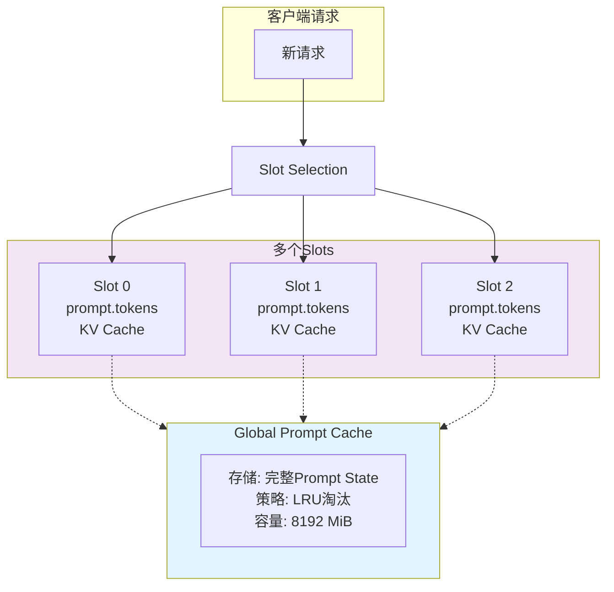
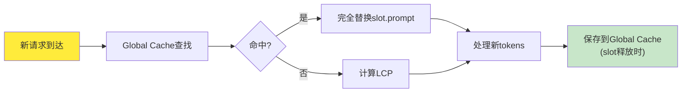
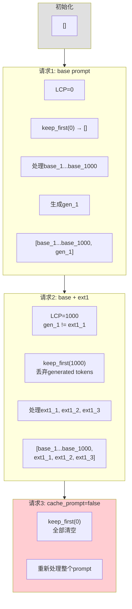
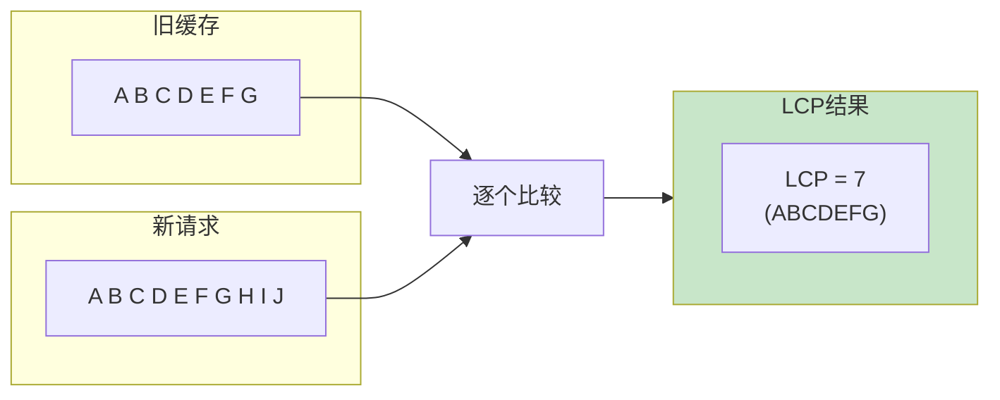
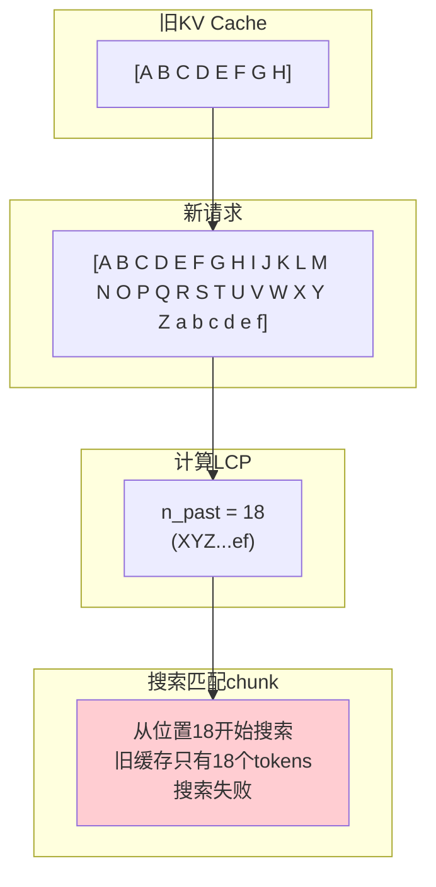
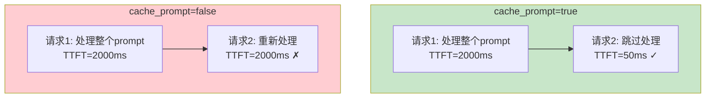
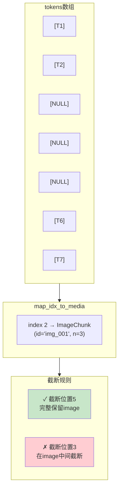
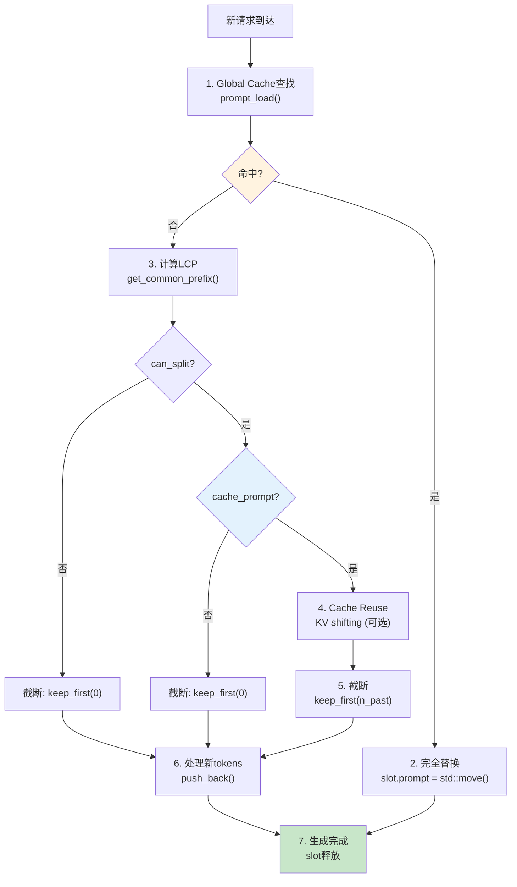

# Prefix Cache 图解集

本文档包含使用Mermaid语法绘制的图表，可以在支持Mermaid的编辑器中查看。

## 1. 两层缓存架构



## 2. 数据流向



## 3. slot.prompt.tokens生命周期



## 4. LCP计算



## 5. Cache Reuse机制



## 6. Global Cache LRU

```mermaid
flowchart LR
    subgraph Before["淘汰前"]
        State0["state0: [A B C D E]\n200 MiB ★最老"]
        State1["state1: [F G H I J]\n200 MiB"]
        State2["state2: [K L M N O]\n200 MiB"]
        State3["state3: [P Q R S T]\n200 MiB ★最新"]
    end

    subgraph After["淘汰后"]
        State1_2["state1: [F G H I J]\n200 MiB ★最老"]
        State2_2["state2: [K L M N O]\n200 MiB"]
        State3_2["state3: [P Q R S T]\n200 MiB"]
        NewState["state4: [U V W X Y]\n200 MiB ★最新"]
    end

    Before -->|pop_front()| After
    NewState --> After

    style Before fill:#fff3e0
    style After fill:#e8f5e9
```

## 7. cache_prompt对比



## 8. Multi-modal处理



## 9. 增长前缀测试分析

```mermaid
gantt
    title 增长前缀请求时序
    dateFormat X
    axisFormat %s

    section 请求1
    处理base (1000tokens) :0, 2106
    TTFT:2106ms         :crit, 2106, 2106

    section 请求2
    LCP计算(1000)       :2106, 2110, 2115
    cache_reuse搜索     :2115, 2125, 2200
    处理ext1(3tokens)   :2200, 2280, 2290
    TTFT:2290ms         :crit, 2290, 2290

    section 请求3
    Global Cache命中    :2290, 2300, 2330
    恢复KV Cache        :2330, 2350, 2400
    TTFT:256ms ✓        :crit, 2546, 2546

    section 请求4
    Global Cache未命中   :2546, 2550, 2600
    重新处理           :2600, 4500, 4647
    TTFT:2101ms ✗       :crit, 4647, 4647
```



## 10. 完整处理流程



## 11. 两层机制对比


## 12. 性能对比

```mermaid
xychart-beta
    title TTFT对比 (ms)
    x-axis [精确R1, 精确R2, 增长R1, 增长R2, 增长R3, 增长R4]
    y-axis 0 --> 2500
    bar [2225, 42, 2106, 2290, 256, 2101]
```

